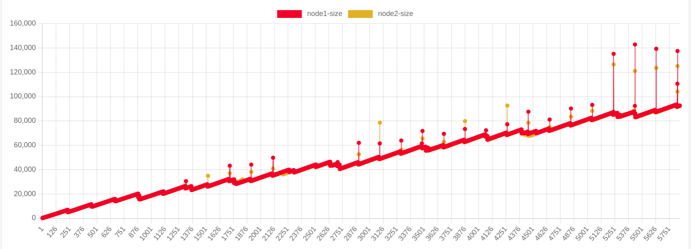
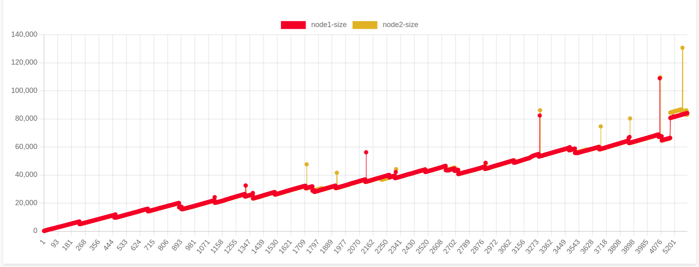
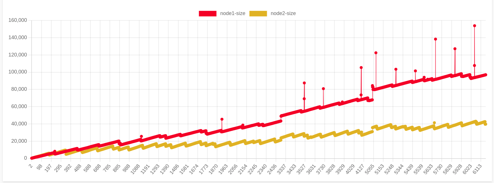
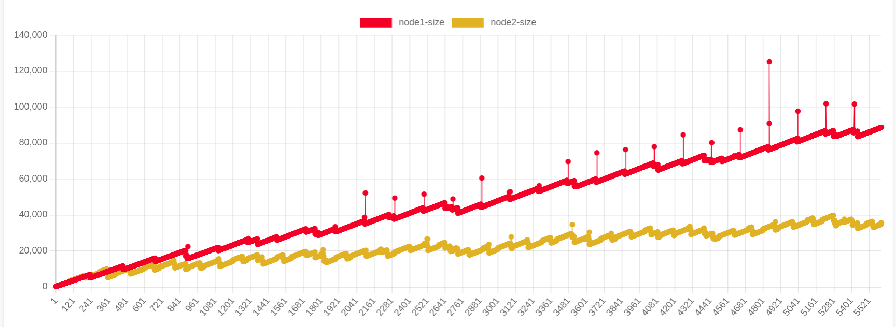
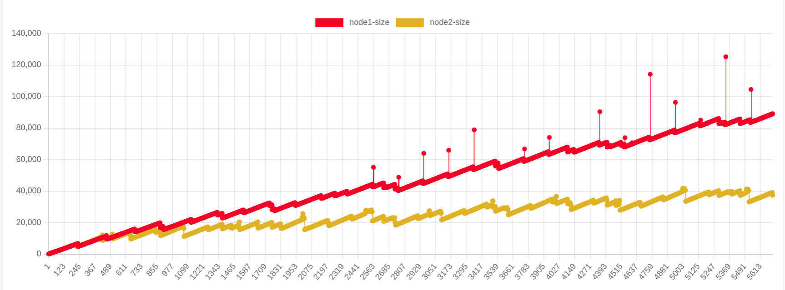
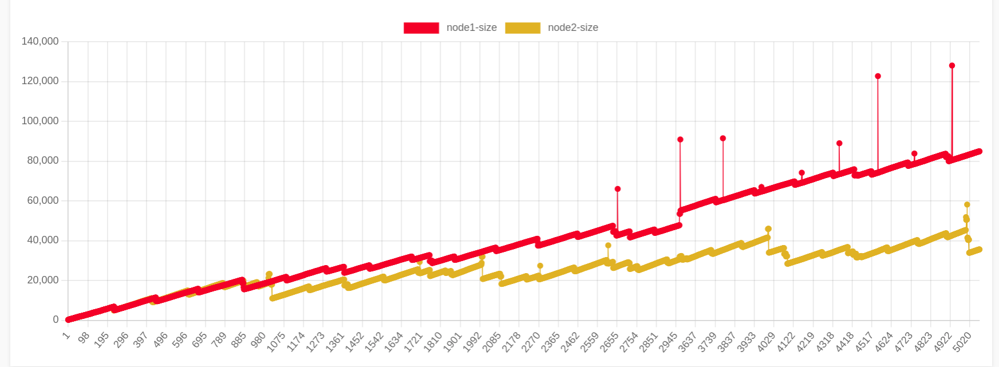

# Pruning in cheqd after upgrading SDK from v0.46 to v0.47

## Pruning Default

Steps followed:

- started a test chain with multiple validators ([multi-node.sh](multi-node.sh) file also attached)
- kept the pruning configuration as default.

```toml
    pruning = "default"
    pruning-keep-recent = "0"
    pruning-interval = "0"
```

- results are stored at file `size_pruning_default.csv` (checking the disk usage at every block)
observation: disk usage of `node1`, `node2` are almost same (node1 ~ node2) after producing the 5000 blocks

_x axis heights, y axis size in KBs_


## Pruning Nothing

Steps followed:

- started a test chain with multiple validators (multi-node.sh file also attached)
- kept the pruning configuration as nothing.

```toml
    pruning = "nothing"
    pruning-keep-recent = "0"
    pruning-interval = "0"
```

- results are stored at file `size_pruning_nothing.csv` (checking the disk usage at every block)
observation: disk usage of `node1`, `node2` are almost same (node1 ~ node2) after producing the 5000 blocks

_x axis heights, y axis size in KBs_


## Pruning Everything

- started a test chain with multiple validators
- kept the pruning configuration as `pruning = "everything"`.

```toml
    pruning = "everything"
    pruning-keep-recent = "0"
    pruning-interval = "0"
```

- results are stored at file `size_pruning_everything.csv` (checking the disk usage at every block)

observation: disk usage of `node2`, is much lesser than the `node1` (node1 > 2 * node2 after running for 5000 blocks)

_x axis heights, y axis size in KBs_


## Pruning custom

- started a test chain with multiple validators
- kept the pruning configuration with 3 different modes.

```toml
    # configuration 1:
    pruning = "custom"
    pruning-keep-recent = "10"
    pruning-interval = "100"
```

_x axis heights, y axis size in KBs_


```toml
    # configuration 2:
    pruning = "custom"
    pruning-keep-recent = "10"
    pruning-interval = "500"
```

_x axis heights, y axis size in KBs_


```toml
    # configuration 3:
    pruning = "custom"
    pruning-keep-recent = "100"
    pruning-interval = "1000"
```



observation: in `configuration1`, `configuration2` the pruning is occuring at every 200-250 blocks range, but for the `configuration3` the pruning is occuring after reaching few (for e.x. 1008, 2012) blocks of every 1000 blocks.

results are attached at:
    configation1:`size_custom_10_100.csv`
    configation2:`size_custom_10_500.csv`
    configation3:`size_custom_100_1000.csv`
